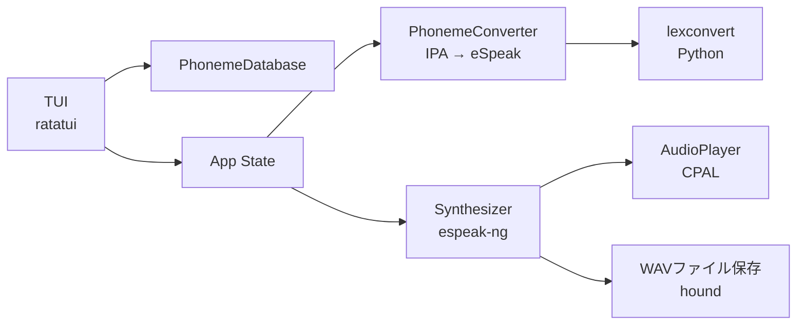
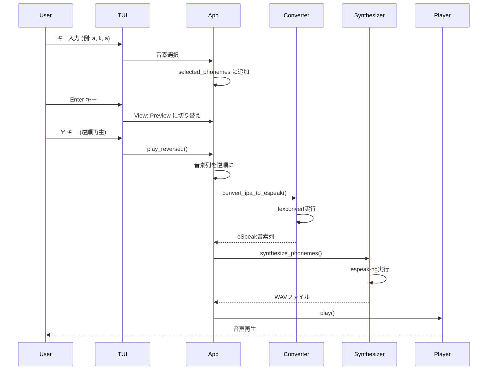

# phoneme-reverser

音素ベースの逆再生音声生成ツール（TUI版）

## 概要

キーボードで音素を選択し、正順・逆順で音声合成して再生・保存できるターミナルUIツールです。通常の波形逆再生と異なり、各音素は自然に発音されるため「発音可能な逆さ言葉」が生成されます。

```
音素選択: [a] [k] [a]
  ↓
正順: /a/ /k/ /a/ → "あかあ"
逆順: /a/ /k/ /a/ → "あかあ"（回文なので同じ）
```

バックマスキング風だが明瞭に聞き取れる、実験的な音声エフェクトツールです。

## 特徴

- **ratatuiベースの直感的なTUI** - ターミナル上で完結するインタラクティブな操作
- **IPA音素 → eSpeak変換による高品質な音声合成** - lexconvertによる音素変換
- **日本語・英語の言語切り替え対応** - `l`キーでリアルタイム切り替え（デフォルト：日本語）
- **リアルタイム再生とファイル保存の両方に対応** - CPALによる音声再生、タイムスタンプ形式での保存
- **母音8個、子音20個の計28音素をサポート** - 日本語・英語の主要音素をカバー

## クイックスタート

### 前提条件

- **Rust** 1.70以上
- **Python** 3.13（仮想環境推奨）
- **espeak-ng** - 音声合成エンジン
- **lexconvert** - IPA → eSpeak音素変換ツール

#### macOS (Homebrew)

```bash
# espeak-ngのインストール
brew install espeak-ng

# Python仮想環境の作成
python3 -m venv .venv
source .venv/bin/activate

# lexconvertのインストール
pip install lexconvert
```

#### Linux (Debian/Ubuntu)

```bash
# espeak-ngのインストール
sudo apt-get install espeak-ng

# Python仮想環境の作成
python3 -m venv .venv
source .venv/bin/activate

# lexconvertのインストール
pip install lexconvert
```

### ビルドと実行

```bash
# ビルド
cargo build --release

# TUI起動
cargo run
```

## 使い方

### 基本操作フロー

1. **音素選択画面で音素を選ぶ**
   - キーボードで `a`, `k`, `u` などの文字を入力
   - 選択した音素が右側のパネルに追加される

2. **プレビュー画面に移動**
   - `Enter` キーでプレビュー画面へ

3. **音声を再生・保存**
   - `p`: 正順音声を再生
   - `r`: 逆順音声を再生
   - `s`: 逆順音声を`wav/`ディレクトリに保存（例: `wav/20260111123456.wav`）

### キーボードショートカット

#### 音素選択画面

| キー | 説明 |
|------|------|
| `a`, `i`, `u`, `e`, `o` | 日本語母音を選択 |
| `@`, `A`, `O` | 英語母音を選択 |
| `p`, `b`, `t`, `d`, `k`, `g`, `m`, `n`, etc. | 子音を選択 |
| `l` | 言語切り替え（日本語 ⇔ English） |
| `Backspace` | 最後の音素を削除 |
| `Enter` | プレビュー画面へ移動 |
| `q` | 終了 |

#### プレビュー画面

| キー | 説明 |
|------|------|
| `p` | 正順音声を再生 |
| `r` | 逆順音声を再生 |
| `s` | 逆順音声を`wav/`ディレクトリに保存（例: `wav/20260111123456.wav`） |
| `l` | 言語切り替え（日本語 ⇔ English） |
| `Esc` | 音素選択画面に戻る |
| `q` | 終了 |

### サポート音素

#### 母音（8個）

| キー | IPA | 説明 |
|------|-----|------|
| `a` | a | 日本語「あ」 |
| `i` | i | 日本語「い」 |
| `u` | u | 日本語「う」 |
| `e` | e | 日本語「え」 |
| `o` | o | 日本語「お」 |
| `@` | ə | 曖昧母音 (about) |
| `A` | ɑ | 後舌開母音 (father) |
| `O` | ɔ | 後舌半開円唇母音 (thought) |

#### 子音（20個）

| カテゴリ | キー | IPA | 説明 |
|---------|------|-----|------|
| 破裂音 | `p` | p | 無声両唇破裂音「ぱ」 |
| | `b` | b | 有声両唇破裂音「ば」 |
| | `t` | t | 無声歯茎破裂音「た」 |
| | `d` | d | 有声歯茎破裂音「だ」 |
| | `k` | k | 無声軟口蓋破裂音「か」 |
| | `g` | g | 有声軟口蓋破裂音「が」 |
| 鼻音 | `m` | m | 両唇鼻音「ま」 |
| | `n` | n | 歯茎鼻音「な」 |
| | `N` | ŋ | 軟口蓋鼻音 (sing) |
| 摩擦音 | `s` | s | 無声歯茎摩擦音「さ」 |
| | `z` | z | 有声歯茎摩擦音「ざ」 |
| | `S` | ʃ | 無声後部歯茎摩擦音「しゃ」 |
| | `Z` | ʒ | 有声後部歯茎摩擦音 (vision) |
| | `h` | h | 無声声門摩擦音「は」 |
| | `f` | f | 無声唇歯摩擦音 (fan) |
| | `v` | v | 有声唇歯摩擦音 (van) |
| 側音/ふるえ音 | `l` | l | 歯茎側音 (light) |
| | `r` | r | 歯茎ふるえ音 (巻き舌) |
| 接近音 | `w` | w | 有声両唇軟口蓋接近音「わ」 |
| | `y` | j | 有声硬口蓋接近音「や」 |

## アーキテクチャ



### 処理フロー



## プロジェクト構成

```
phoneme-reverser/
├── Cargo.toml              # Rustプロジェクト設定
├── .gitignore              # Git除外設定（wav/ディレクトリを含む）
├── src/
│   ├── main.rs             # エントリーポイント、TUIメインループ
│   ├── lib.rs              # ライブラリルート
│   ├── error.rs            # エラー型定義
│   ├── converter.rs        # IPA → eSpeak音素変換 (PyO3 + lexconvert)
│   ├── synth.rs            # espeak-ngによる音声合成
│   ├── audio.rs            # WAV読み書き (hound)
│   ├── playback.rs         # 音声再生 (CPAL)
│   └── tui/
│       ├── mod.rs          # TUIモジュールルート
│       ├── app.rs          # アプリケーション状態管理
│       ├── ui.rs           # UI描画ロジック (ratatui)
│       ├── event.rs        # キーボードイベント処理
│       └── phoneme_db.rs   # 音素データベース（28音素）
├── wav/                    # 生成された音声ファイル（gitignore対象）
└── README.md
```

### 主要モジュールの責務

| モジュール | 責務 | 主要な型/関数 |
|-----------|------|-------------|
| `tui::app` | アプリケーション状態管理 | `App`, `View`, `PlaybackStatus` |
| `tui::ui` | UI描画（3カラムレイアウト） | `render()`, `render_phoneme_selection()`, `render_preview()` |
| `tui::event` | キーボードイベント処理 | `handle_events()` |
| `tui::phoneme_db` | 音素データベース（28音素） | `PhonemeDatabase`, `Phoneme`, `PhonemeCategory` |
| `converter` | IPA → eSpeak変換 | `PhonemeConverter::convert_ipa_to_espeak()` |
| `synth` | espeak-ngによる音声合成 | `synthesize_phonemes()`, `SynthConfig` |
| `playback` | CPAL音声再生 | `AudioPlayer::play()` |
| `audio` | WAV読み書き | `read_wav()`, `write_wav()` |

### 技術スタック

| カテゴリ | 技術 | 用途 |
|---------|------|------|
| UI | ratatui 0.29 | ターミナルUI描画 |
| | crossterm 0.28 | ターミナル制御・イベント処理 |
| 音素変換 | PyO3 0.22 | Pythonバインディング |
| | lexconvert (Python) | IPA → eSpeak音素変換 |
| 音声合成 | espeak-ng | テキスト/音素 → 音声合成 |
| 音声再生 | CPAL 0.15 | クロスプラットフォーム音声再生 |
| ファイルI/O | hound 3.5 | WAV読み書き |
| その他 | chrono 0.4 | タイムスタンプ生成 |
| | tempfile 3.14 | 一時ファイル管理 |
| | thiserror 2.0 | エラー型定義 |

